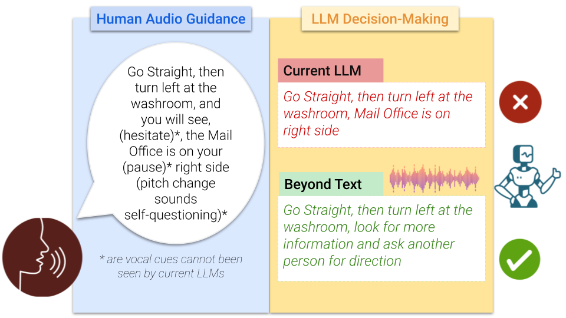
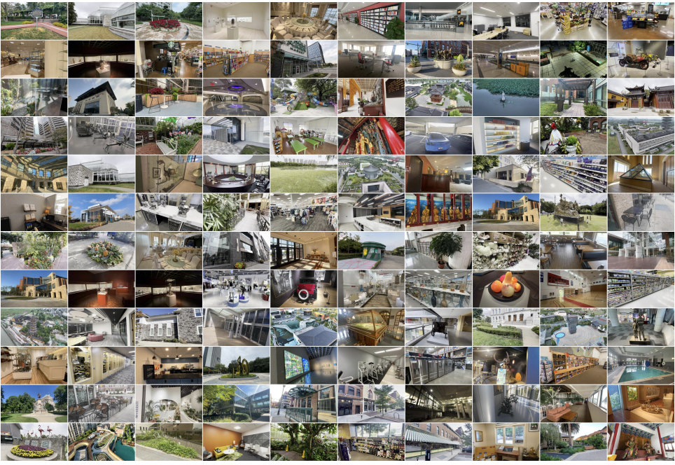

About Me
======
Welcome! I am Xingpeng Sun, a second-year Ph.D. student in Computer Science at [Purdue University](https://www.cs.purdue.edu/). I am fortunate to be advised by [Prof. Aniket Bera](https://scholar.google.com/citations?hl=en&user=q3UdHk4AAAAJ&view_op=list_works&sortby=pubdate). Previously, I received my B.S. degree in Computer Science and Mathematics at [University of Wisconsin-Madison](https://www.wisc.edu/) with Distinctive Scholastic Achievement.

My research interest is in foundation model, robotics, and graphics. I am eager to work on the intersection of large language model (LLM) + robotics & graphics, focus on advancing the capabilities and safety of autonomous systems through enhanced natural language understanding and decision-making processes. I also work on text-guided trajectory generation and 3D assets editing.

<b style="color: red;">I am actively seeking research internship opportunities in LLM/VLM, Embodied AI, and AIGC for summer 2025. If you know of any exciting opportunities or just want to chat about potential collaborations, feel free to drop me an email.</b>

News
======
1. 10/2024: [**Beyond Text**](https://arxiv.org/pdf/2402.03494) is accepted by **TMLR**!
1. 06/2024: [**TrustNavGPT**](https://arxiv.org/pdf/2408.01867) is accepted by **IROS** 2024 as Oral Presentation!
1. 02/2024: [**DL3DV-10K**](https://arxiv.org/abs/2312.16256) is accepted by **CVPR** 2024!

Publications
======

<ul>
  <li style="display: flex; align-items: center;">
    
    

      <a href="#"><b>Beyond Text: Utilizing Vocal Cues to Improve Decision Making in LLMs for Robot Navigation Tasks</b></a>
       
      <b>Xingpeng Sun</b>, Haoming Meng, Souradip Chakraborty, Amrit Singh Bedi, Aniket Bera
       
      <i>Transactions on Machine Learning Research (TMLR), 2024 </i>.    
      <a href="https://arxiv.org/pdf/2402.03494">[Paper]</a>     
    

  </li>
</ul>

<ul>
  <li style="display: flex; align-items: center;">
    
    

      <a href="#"><b>TrustNavGPT: Modeling Uncertainty to Improve Trustworthiness of Audio-Guided LLM-Based Robot Navigation</b></a>
       
      <b>Xingpeng Sun</b>, Yiran Zhang, Xindi Tang, Amrit Singh Bedi, Aniket Bera
       
      <i>IEEE/RSJ International Conference on Intelligent Robots and Systems (IROS), 2024 <b style="color: red;">(Oral)</b></i>.    
      <a href="https://arxiv.org/pdf/2408.01867">[Paper]</a>     
    

  </li>
</ul>

<ul>
  <li style="display: flex; align-items: center;">
      
    

      <a href="#"><b>DL3DV-10K: A Large-Scale Scene Dataset for Deep Learning-based 3D Vision</b></a>
       
      Lu Ling, Yichen Sheng, Zhi Tu, Wentian Zhao, Cheng Xin, Kun Wan, Lantao Yu, Qianyu Guo, Zixun Yu, Yawen Lu, Xuanmao Li, <b>Xingpeng Sun</b>, Rohan Ashok, Aniruddha Mukherjee, Hao Kang, Xiangrui Kong, Gang Hua, Tianyi Zhang, Bedrich Benes, Aniket Bera
        
      <i>IEEE/CVF Conference on Computer Vision and Pattern Recognition (CVPR), 2024</i>.  
      <a href="https://openaccess.thecvf.com/content/CVPR2024/html/Ling_DL3DV-10K_A_Large-Scale_Scene_Dataset_for_Deep_Learning-based_3D_Vision_CVPR_2024_paper.html">[Paper]</a> 
      <a href="https://dl3dv-10k.github.io/DL3DV-10K/">[Project Page]</a>      
    

  </li>
</ul>

Service
------
Reviewer: ICRA 25, IROS 24, SIGGRAPH ASIA 24, PACIFIC GRAPHICS 24, ICSR 24

Miscellaneous
------
I like to watch soccer games, and also travelling. I wrote a [course guide](https://xingpengs.github.io/) about all courses that I've taken at UW-Madison. My girlfriend is currently pursuing her Ph.D. in Analytical Chemistry at Purdue University. Her research focuses on the specialized field of Mass Spectrometry Imaging.
